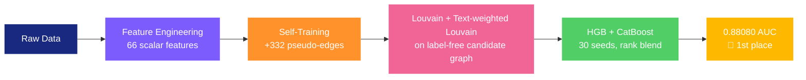

<div align="center">

# Link Prediction in an Actor Co-occurrence Network


**Predicting missing edges in a sparse actor co-occurrence graph using hand-crafted features and gradient boosting. Best Kaggle public AUC: 0.88080 (1st place).**

</div>

---

## The Challenge

Given a partially observed graph where **nodes = actors** and **edges = co-occurrence on Wikipedia pages**, predict which edges were randomly deleted. Each node has **932 binary keyword features**. Evaluation metric: **AUC-ROC**.

The catch: the graph is extremely sparse (mean degree ~2.9) and **91.5% of test pairs share zero common neighbors**, making classical graph heuristics alone insufficient.

## Strategy Overview



The core insight behind our approach: **with only 10K training samples, scalar hand-crafted features massively outperform learned representations**. Every embedding-based method we tried (SVD, Node2Vec, GCN, TabPFN) overfit, flattened out, or added nothing to the blend. Instead, we engineered 66 carefully chosen scalar features, each targeting a different aspect of what makes two actors likely to co-occur. The three biggest jumps all came from fundamentally new information sources: pair-level transductive features (v24/v25, 0.867→0.872), global community structure on a label-free candidate graph (v26b/d, 0.872→0.8805), and a second Louvain partition on a *text-weighted* variant of the same graph (v26g, 0.8805→0.88080).

### 1. Feature Engineering (66 features)

We build features that answer six distinct questions about each node pair:

| | Family | # | Question it answers |
|---|---|---|---|
| **Graph** | Topology | 14 | _Are these nodes close in the graph?_ |
| **Text** | Similarity | 9 | _Do these actors share similar keywords?_ |
| **Node transductive** | Meta-signals | 6 | _How often do u and v appear in train/test pairs?_ |
| **Pair transductive (v24)** | Test-set structure | 7 | _Do u and v share other test partners?_ |
| **Pair transductive (v25)** | Test-set higher-order | 8 | _Triangles in test space, Adamic-Adar on test partners?_ |
| **Hybrid** | Neighborhood text | 4 | _Does this actor look like the other's friends?_ |
| **Derived** | Katz, hubs, interactions | 8 | _What do higher-order paths and feature interactions tell us?_ |
| **Community (v26b)** | Louvain partition + spectral | 6 | _Are u and v in the same cluster? How close in spectral space?_ |
| **Community CN (v26d)** | Common neighbors ∩ community | 1 | _Do u and v share common neighbors inside their cluster?_ |
| **Text community (v26g)** | Text-weighted Louvain | 3 | _Are u and v in the same text-aware cluster?_ |

**Graph topology** — We compute classical link prediction indices from the literature: Common Neighbors, Jaccard, Adamic-Adar, Resource Allocation, Sorensen, and Preferential Attachment. We also extract degree features (raw, sum, difference, log-transformed, min/max) and component membership flags. For pairs with CN=0 (the vast majority), we go beyond direct neighbors with **paths of length 3** ($A^3[u,v]$ via sparse matrix multiplication), which captures indirect connectivity that CN misses entirely.

> **Leakage correction**: For positive training pairs, the direct edge $u$-$v$ inflates $A^3[u,v]$ by $\deg(u) + \deg(v) - 1$ spurious walks. We subtract this analytically to prevent the model from simply memorizing which edges exist.

**Text similarity** — From the 932 binary keyword columns, we extract raw dot product, cosine similarity, TF-IDF cosine (downweights common keywords like "actor"), TF-IDF L2 distance, keyword Jaccard, and asymmetric overlap (captures whether one actor's keywords are a subset of the other's).

**Neighborhood text** — For each node, we average its neighbors' TF-IDF vectors, then ask: _"Does node $v$'s text profile match what node $u$'s friends look like?"_ This is essentially a manual 1-hop GCN aggregation expressed as scalar features — capturing the same signal without the overfitting risk of learned embeddings. We also correct for leakage on positive training pairs by excluding $v$'s contribution from $u$'s neighborhood average.

**Node-level transductive features** — Big single improvement (+0.011 AUC). We count how many times each node appears across all pairs (train + test). Nodes appearing frequently in the test set likely had more edges deleted. We separate train-only and test-only counts and add interaction terms for richer signal.

**Pair-level transductive features (v24 — +0.003 AUC, then v25 — another +0.001 AUC)** — Pushing the transductive insight one order higher: instead of counting node appearances, we look at *shared partners across the test set*. For each pair $(u, v)$:

*v24 features (7):*
- $\text{test\_partners}(u)$ = set of nodes that appear in some test pair with $u$
- $|\text{test\_partners}(u) \cap \text{test\_partners}(v)|$ — how many other nodes are "test partners" of both $u$ and $v$
- Same for train partners and combined train+test partners
- Jaccard variants of these intersections
- min/max of $|\text{test\_partners}|$ on each side

*v25 features (8) — same direction, higher order:*
- `test_triangles` = $|\{w : (u,w) \in \text{test} \land (w,v) \in \text{test}\}|$ — paths of length 2 through the test set
- `train_triangles` = same with train pairs
- `mixed_triangles` = $|\{w : (u,w) \in \text{train} \land (w,v) \in \text{test}\}|$ + symmetric
- `shared_test_aa` = $\sum_{w \in \text{shared}} 1/\log(\text{test\_count}(w))$ — Adamic-Adar style on the test partner space
- `shared_test_ra` = resource-allocation variant
- `shared_total_pa` = $|\text{test\_partners}(u)| \cdot |\text{test\_partners}(v)|$ — preferential attachment in test space
- `exclusive_test_u` = $|\text{test\_partners}(u) \setminus \text{test\_partners}(v)|$ + symmetric

These features are **leakage-free** (no labels used) but reveal a form of higher-order structure that v19's node-level counts cannot capture: if two actors share many test partners, they likely belong to the same cluster in the original graph and the edge between them was probably one of those that got deleted. On training data the signal is sparse but strongly directional: positive pairs have on average **12× more shared test partners** than negative pairs (v24 features), and **23× more test triangles** (v25 features).

**Community structure on a label-free candidate graph (v26b — +0.00830 Kaggle, biggest single jump since v19).** v24/v25 look at pair-level set intersections; v26b turns the same idea into a *global* partition of the node set. We build an undirected **candidate graph** whose edges are every pair that appears in `train.txt` (regardless of label) plus every pair in `test.txt` plus the v25 self-training pseudo-edges, then run **Louvain community detection** on it. This is leakage-free because we never use the training labels to decide which edges go in the graph — positive and negative train pairs contribute equal edges. For a held-out positive pair `(u, v)` the direct edge is in the graph either way, so `same_community` cannot trivially memorize the label; the signal has to come from the *surrounding* structure. We also compute a **Laplacian eigenmap** (k=16) on the same graph and turn it into three pair-level features (L2 distance, dot product, cosine) — inspired by Kunegis & Lommatzsch (ICML 2009).

> **Why this works where GCN failed.** A 2-layer end-to-end GCN on the same data scored 0.670 — massive overfitting. The community and spectral features capture the same kind of "is this pair near each other in the graph" signal but they are **scalar** rather than learned high-dimensional embeddings, so the gradient booster can use them without overfitting. Seven new scalars, +0.00830 Kaggle.

**Community common neighbors (v26d — +0.00012 Kaggle).** A single extra feature: among the common neighbors of `u` and `v` in the candidate graph, count how many belong to `u`'s or `v`'s Louvain community. Positive pairs had this count ≈10× higher than negative pairs, but v26c already showed that bundling it with four other marginal community features *hurts* the gradient booster — so v26d is v26b *exactly* plus this one column, nothing else.

**Text-weighted Louvain community (v26g — +0.00030 Kaggle, current best).** After v26d plateaued, every further tweak of the unweighted Louvain partition (higher resolution, Leiden algorithm, multi-seed consensus) kept finding essentially the same 16 clusters. The only way to break out was to change the *graph itself*, not the clustering algorithm. v26g runs a **second Louvain** on a variant of the candidate graph whose edges are weighted `1.0 + 3.0 × tfidf_cosine(u, v)` — actors with similar Wikipedia keywords are pulled into the same cluster more strongly. The two partitions are structurally very different (**ARI ≈ 0.063**; ARI = 1 would mean identical). We add three columns: same-community flag and min/max community sizes under the text-weighted partition, on top of the v26d feature set.

### 2. Self-Training Graph Augmentation

The sparse graph limits what structural features can capture. To enrich it:

1. Train an initial model on base features
2. Predict test pairs — add the ~320 with probability >= 0.95 as pseudo-edges
3. Rebuild the entire graph and recompute all graph-dependent features

This single conservative round improved downstream features (CN, paths3, neighborhood text all benefit from a denser graph). We tried multiple rounds and lower thresholds — both added noise and hurt Kaggle score.

### 3. Ensemble & Seed Averaging

Final predictions combine **HistGradientBoosting** and **CatBoost** (30 random seeds each) via **rank averaging**. Since AUC is rank-based, converting each model's predictions to ranks before blending eliminates calibration mismatches. The two boosting algorithms make different errors, and their combination is more stable than either alone.

## Results

| Approach | Features | Public AUC |
|---|---|---|
| GCN (end-to-end) | adjacency + keywords | 0.670 |
| Node2Vec embeddings | 87 | 0.770 |
| SVD/NMF embeddings | 151 | 0.790 |
| Graph heuristics only | 14 | 0.831 |
| + Text similarity | 23 | 0.850 |
| + Self-training | 23 | 0.851 |
| + Node transductive counts | 27 | 0.861 |
| + Paths3, Neighborhood text (v19) | 36 | 0.867 |
| + Feature interactions (v19) | 41 | 0.86766 |
| + Pair-level transductive (v24) | 48 | 0.87091 |
| + Higher-order pair transductive (v25) | 56 | 0.87208 |
| + Community + spectral on candidate graph (v26b) | 62 | 0.88038 |
| + Community common neighbors (v26d) | 63 | 0.88050 |
| **+ Text-weighted Louvain community (v26g)** | **66** | **0.88080** 🥇 |

> Every embedding-based method made things worse. On small datasets, feature discipline beats model complexity.

### The v24 + v25 breakthrough

After v19 (0.867) we ran six controlled experiments (more seeds, LightGBM in the blend, dual self-training, pseudo-labeling, feature bagging, hyperparam variations, train/test symmetric augmentation). Every single one scored *below* v19 by 0.001-0.0014 on Kaggle. v19 was at a tight local optimum.

The breakthrough only came when we added a fundamentally new family of features — **pair-level transductive signals** — rather than perturbing the existing pipeline. v24 introduced 7 features built from `test_partners(u) ∩ test_partners(v)` style intersections (+0.003 Kaggle). v25 then doubled down in the same direction with 8 more (transductive triangles, Adamic-Adar in test partner space, preferential attachment in test space) for another +0.001 Kaggle.

The lesson: when local search has plateaued, look for an orthogonal source of information rather than reshuffling what you already have. And when a new direction works, exploit it deeper before going elsewhere.

### The v26b community breakthrough (0.87208 → 0.88038, +0.00830)

v25 saturated just like v19 had, and once again perturbations of the existing pipeline all failed. The jump came from a completely new information source: **global community structure on a label-free candidate graph**.

We build a candidate graph that contains every pair appearing in `train.txt` or `test.txt` (regardless of label) plus the v25 self-training pseudo-edges, all with weight 1.0. Running Louvain on it gives a partition of the 3,597 actors into ≈16 communities. From that we derive three community features (`same_community`, `community_size_min`, `community_size_max`) and three spectral features on the k=16 Laplacian eigenmap of the same graph (pair L2 distance, dot product, cosine). Six scalar columns total.

Why this works where earlier GCN/Node2Vec attempts failed: the community and spectral features capture the same "are these two actors near each other in the graph" signal that a GNN would try to learn, but as a handful of *scalar* features rather than learned high-dimensional embeddings. Gradient boosting handles them cleanly without the overfitting that killed every embedding-based method we tried. +0.00830 Kaggle from 6 new columns — the biggest single-jump since the v12 transductive counts.

### The v26d / v26g refinement (0.88038 → 0.88050 → 0.88080)

After v26b we tried to push the community idea further with ten more features (percentile community sizes, internal density, multi-resolution same-community flags, k-NN between communities). That was v26c and it *regressed* on Kaggle to 0.87930. The extra features diluted the gradient booster. v26d recovered by adding *only* `comm_cn` (common neighbors restricted to the same community, the one feature in the v26c bundle with a truly strong pos/neg gap). Minimal-risk single-feature addition, +0.00012 Kaggle.

v26e tried **Leiden** (Traag et al. 2019) on the same graph. Different algorithm, essentially the same partition — ARI vs Louvain was 0.21 but per-pair signal was nearly identical (same positives, different community boundaries), net OOF gain +0.00030. Not worth a submission slot.

The v26g breakthrough came from changing the *graph* rather than the algorithm: a second Louvain partition on a **text-weighted** variant of the candidate graph, with edge weight `1.0 + 3.0 × tfidf_cosine(u, v)`. ARI against the unweighted Louvain dropped to **0.063** — the partitions are structurally very different. Three new columns (text-weighted `same_community` + community sizes), +0.00030 Kaggle, new 1st place at 0.88080.

**Meta-lesson across v26b → v26d → v26g.** Every gain in the v26 family came from minimal-risk single-family additions. Every time we tried to bundle multiple "promising" features together (v26c, v26f) we lost. With 10K training samples and a gradient booster, the right discipline is: **one proven feature at a time, ablate alone first, add only if OOF strictly improves AND Spearman(new, old) < 0.999.**

## What Didn't Work

| Approach | AUC | Why it failed |
|---|---|---|
| GCN (2-layer) | 0.670 | Massive overfitting on 10K samples |
| Node2Vec (64-d) | 0.770 | Too many dimensions for small data |
| SVD/NMF embeddings | 0.790 | Curse of dimensionality |
| Multi-round self-training | < 0.867 | Lower thresholds add noisy edges |
| Personalized PageRank | ~1.0 OOF | Leakage too complex to correct analytically |
| Stacking meta-learner | < 0.861 | Further overfits the small dataset |
| More seeds (30 → 50) | 0.86655 | Marginal noise; already at the variance floor |
| +LightGBM in blend | 0.86629 | LGB errors are not better, just different |
| Dual self-training (0.95 + 0.97) | 0.86660 | Slightly noisier graph than single round |
| Pseudo-labeling test → training rows | 0.86674 | Confirmation bias outweighs added data |
| Feature bagging across subsets | 0.86341 | Subsets too narrow, lose signal |
| Symmetric (u,v)↔(v,u) augmentation | 0.86741 | Order signal in v19 features is not spurious |
| Hyperparam micro-variations | 0.86672 | v19 hyperparams already near-optimal |
| v26c: 10 extra community features | 0.87930 | Marginal columns diluted the strong community signal |
| v26e: Leiden instead of Louvain | untested | Different algo, ARI 0.21, same per-pair signal (+0.00030 OOF) |
| v26f: v26d + full text community + text spectral + text comm_cn | ≈0.880 | Text spectral actively hurt; text comm_cn was redundant |
| TabPFN on v25 features, rank blend with v25 | OOF +0.00002 | TabPFN lacked community signal, almost perfectly correlated with v25 |
| TabPFN on v26d features, rank blend with v26d | OOF +0.00004 | Even with community features the models converged (Spearman 0.983) |

## Repo Structure

```
├── experiments_v26g.py       # 🥇 BEST solution (v26d + text-weighted Louvain, 0.88080)
├── experiments_v26d.py       # v26b + comm_cn (0.88050)
├── experiments_v26b.py       # Community + spectral on label-free candidate graph (0.88038)
├── experiments_v25.py        # v19 + v24 + v25 pair-transductive (0.87208)
├── experiments_v24.py        # First pair-transductive breakthrough (0.87091)
├── best_solution.py          # v19 baseline (41 features, 0.86766)
├── experiments_v21.py        # Controlled experiments (more seeds, +LGB, dual self-train)
├── experiments_v22.py        # Pseudo-labeling, feature bagging, hyperparam variants
├── experiments_v23.py        # Symmetric augmentation (TTA + train doubled)
├── logistic_regression.py    # Baseline: LR with 16 features
├── hist_gradient_boosting.py # HGB baseline
├── xgb_hgb_lr_ensemble.py    # Early ensemble experiment
├── train.txt                 # 10,496 labeled pairs (50% positive)
├── test.txt                  # 3,498 test pairs
├── node_information.csv      # 3,597 nodes x 932 keyword features
├── report.tex                # 3-page LaTeX report
└── RESULTS.md                # Full progression of every submission
```

## Reproduce

```bash
pip install numpy pandas scikit-learn scipy catboost networkx python-louvain
python experiments_v26g.py
```

`experiments_v26g.py` is the only script you need to run to obtain the current winning submission. It rebuilds everything from scratch (graph, features, self-training, two Louvain passes, training, blend) and outputs `submission_v26g.csv` — the 0.88080 entry. Runs in ~1 minute on a laptop. The v26g script imports a few helpers from `experiments_v25.py`, `experiments_v26b.py`, and `experiments_v26d.py`, so all four files need to sit in the same directory.

### Reproducibility guarantees

The pipeline is deterministic:
- All `random_state` are explicitly set (`SEED = 42` for HGB, CatBoost, and `np.random.seed`)
- The 30-seed ensemble uses fixed seed offsets (`SEED + s * 31`)
- Louvain is called through `python-louvain` with an explicit `random_state=42`; both the unweighted and the text-weighted passes are reproducible across runs
- All sets used in feature computation contain only integers; Python only randomizes string hashes, so set iteration order is stable across runs
- No GPU, no multi-threading randomness, no external network calls

For v25 specifically, running `experiments_v25.py` twice produced byte-identical `submission_v25.csv` files (max abs diff = 0, Spearman correlation = 1.0). The v26 family preserves the same determinism guarantees with the added Louvain and spectral passes.

### A note on transductive features

Our biggest gains come from features that use the **structure of the test set** (which node IDs appear together as test pairs) without ever using the test labels. This is **transductive learning** — a standard ML technique that is allowed in this competition since the file `test.txt` is provided as input. We never look at the labels we are trying to predict; we only count co-occurrences in the released test pair list. Our score on out-of-fold cross-validation is inflated (~0.90 vs ~0.87 on Kaggle) because the same transductive counts are computed across train+test together, but the inflation is consistent and the signal still transfers to the held-out test predictions on Kaggle.

## Key References

- Liben-Nowell & Kleinberg — [The Link Prediction Problem for Social Networks](https://doi.org/10.1002/asi.20591) (JASIST 2007)
- Adamic & Adar — [Friends and Neighbors on the Web](https://doi.org/10.1016/j.socnet.2004.11.003) (Social Networks 2003)
- Katz — [A New Status Index Derived from Sociometric Analysis](https://doi.org/10.1007/BF02289026) (Psychometrika 1953)
- Blondel, Guillaume, Lambiotte & Lefebvre — [Fast unfolding of communities in large networks](https://doi.org/10.1088/1742-5468/2008/10/P10008) (J. Stat. Mech. 2008) — the Louvain method used in v26b/d/g
- Kunegis & Lommatzsch — [Learning Spectral Graph Transformations for Link Prediction](https://doi.org/10.1145/1553374.1553447) (ICML 2009) — inspiration for the spectral feature family in v26b
- Traag, Waltman & van Eck — [From Louvain to Leiden: guaranteeing well-connected communities](https://doi.org/10.1038/s41598-019-41695-z) (Scientific Reports 2019) — tried as v26e, did not outperform Louvain on this dataset
- Ke et al. — [LightGBM](https://papers.nips.cc/paper/2017/hash/6449f44a102fde848669bdd9eb6b76fa-Abstract.html) (NeurIPS 2017)
- Prokhorenkova et al. — [CatBoost](https://papers.nips.cc/paper/2018/hash/14491b756b3a51daac41c24863285549-Abstract.html) (NeurIPS 2018)
