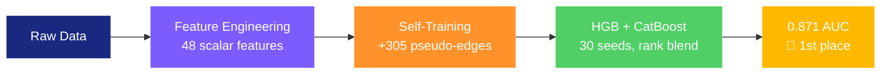

<div align="center">

# Link Prediction in an Actor Co-occurrence Network


**Predicting missing edges in a sparse actor co-occurrence graph using hand-crafted features and gradient boosting. Final Kaggle public AUC: 0.87091 (1st place).**

</div>

---

## The Challenge

Given a partially observed graph where **nodes = actors** and **edges = co-occurrence on Wikipedia pages**, predict which edges were randomly deleted. Each node has **932 binary keyword features**. Evaluation metric: **AUC-ROC**.

The catch: the graph is extremely sparse (mean degree ~2.9) and **91.5% of test pairs share zero common neighbors**, making classical graph heuristics alone insufficient.

## Strategy Overview



The core insight behind our approach: **with only 10K training samples, scalar hand-crafted features massively outperform learned representations**. Every embedding-based method we tried (SVD, Node2Vec, GCN) overfit and hurt performance. Instead, we engineered 48 carefully chosen scalar features, each targeting a different aspect of what makes two actors likely to co-occur — culminating in **pair-level transductive features** (v24) that delivered the final breakthrough from 0.867 to 0.871.

### 1. Feature Engineering (48 features)

We build features that answer four distinct questions about each node pair:

| | Family | # | Question it answers |
|---|---|---|---|
| **Graph** | Topology | 14 | _Are these nodes close in the graph?_ |
| **Text** | Similarity | 9 | _Do these actors share similar keywords?_ |
| **Node transductive** | Meta-signals | 6 | _How often do u and v appear in train/test pairs?_ |
| **Pair transductive (v24)** | Test-set structure | 7 | _Do u and v share other test partners?_ |
| **Hybrid** | Neighborhood text | 4 | _Does this actor look like the other's friends?_ |
| **Derived** | Katz, hubs, interactions | 8 | _What do higher-order paths and feature interactions tell us?_ |

**Graph topology** — We compute classical link prediction indices from the literature: Common Neighbors, Jaccard, Adamic-Adar, Resource Allocation, Sorensen, and Preferential Attachment. We also extract degree features (raw, sum, difference, log-transformed, min/max) and component membership flags. For pairs with CN=0 (the vast majority), we go beyond direct neighbors with **paths of length 3** ($A^3[u,v]$ via sparse matrix multiplication), which captures indirect connectivity that CN misses entirely.

> **Leakage correction**: For positive training pairs, the direct edge $u$-$v$ inflates $A^3[u,v]$ by $\deg(u) + \deg(v) - 1$ spurious walks. We subtract this analytically to prevent the model from simply memorizing which edges exist.

**Text similarity** — From the 932 binary keyword columns, we extract raw dot product, cosine similarity, TF-IDF cosine (downweights common keywords like "actor"), TF-IDF L2 distance, keyword Jaccard, and asymmetric overlap (captures whether one actor's keywords are a subset of the other's).

**Neighborhood text** — For each node, we average its neighbors' TF-IDF vectors, then ask: _"Does node $v$'s text profile match what node $u$'s friends look like?"_ This is essentially a manual 1-hop GCN aggregation expressed as scalar features — capturing the same signal without the overfitting risk of learned embeddings. We also correct for leakage on positive training pairs by excluding $v$'s contribution from $u$'s neighborhood average.

**Node-level transductive features** — Big single improvement (+0.011 AUC). We count how many times each node appears across all pairs (train + test). Nodes appearing frequently in the test set likely had more edges deleted. We separate train-only and test-only counts and add interaction terms for richer signal.

**Pair-level transductive features (v24 — the final +0.003 AUC)** — Pushing the transductive insight one order higher: instead of counting node appearances, we look at *shared partners across the test set*. For each pair $(u, v)$:

- $\text{test\_partners}(u)$ = set of nodes that appear in some test pair with $u$
- $|\text{test\_partners}(u) \cap \text{test\_partners}(v)|$ — how many other nodes are "test partners" of both $u$ and $v$
- Same for train partners and combined train+test partners
- Jaccard variants of these intersections
- min/max of $|\text{test\_partners}|$ on each side

These features are **leakage-free** (no labels used) but reveal a form of higher-order structure that v19's node-level counts cannot capture: if two actors share many test partners, they likely belong to the same cluster in the original graph and the edge between them was probably one of those that got deleted. On training data this signal is sparse but strongly directional: positive pairs have on average **12× more shared test partners** than negative pairs.

### 2. Self-Training Graph Augmentation

The sparse graph limits what structural features can capture. To enrich it:

1. Train an initial model on base features
2. Predict test pairs — add the ~320 with probability >= 0.95 as pseudo-edges
3. Rebuild the entire graph and recompute all graph-dependent features

This single conservative round improved downstream features (CN, paths3, neighborhood text all benefit from a denser graph). We tried multiple rounds and lower thresholds — both added noise and hurt Kaggle score.

### 3. Ensemble & Seed Averaging

Final predictions combine **HistGradientBoosting** and **CatBoost** (30 random seeds each) via **rank averaging**. Since AUC is rank-based, converting each model's predictions to ranks before blending eliminates calibration mismatches. The two boosting algorithms make different errors, and their combination is more stable than either alone.

## Results

| Approach | Features | Public AUC |
|---|---|---|
| GCN (end-to-end) | adjacency + keywords | 0.670 |
| Node2Vec embeddings | 87 | 0.770 |
| SVD/NMF embeddings | 151 | 0.790 |
| Graph heuristics only | 14 | 0.831 |
| + Text similarity | 23 | 0.850 |
| + Self-training | 23 | 0.851 |
| + Node transductive counts | 27 | 0.861 |
| + Paths3, Neighborhood text (v19) | 36 | 0.867 |
| + Feature interactions (v19) | 41 | 0.86766 |
| **+ Pair-level transductive (v24)** | **48** | **0.87091** 🥇 |

> Every embedding-based method made things worse. On small datasets, feature discipline beats model complexity.

### The v24 breakthrough

After v19 (0.867) we ran six controlled experiments (more seeds, LightGBM in the blend, dual self-training, pseudo-labeling, feature bagging, hyperparam variations, train/test symmetric augmentation). Every single one scored *below* v19 by 0.001-0.0014 on Kaggle. v19 was at a tight local optimum.

The breakthrough only came when we added a fundamentally new family of features — **pair-level transductive signals** — rather than perturbing the existing pipeline. The lesson: when local search has plateaued, look for an orthogonal source of information rather than reshuffling what you already have.

## What Didn't Work

| Approach | AUC | Why it failed |
|---|---|---|
| GCN (2-layer) | 0.670 | Massive overfitting on 10K samples |
| Node2Vec (64-d) | 0.770 | Too many dimensions for small data |
| SVD/NMF embeddings | 0.790 | Curse of dimensionality |
| Multi-round self-training | < 0.867 | Lower thresholds add noisy edges |
| Personalized PageRank | ~1.0 OOF | Leakage too complex to correct analytically |
| Stacking meta-learner | < 0.861 | Further overfits the small dataset |
| More seeds (30 → 50) | 0.86655 | Marginal noise; we're already at the variance floor |
| +LightGBM in blend | 0.86629 | LGB errors are not better, just different |
| Dual self-training (0.95 + 0.97) | 0.86660 | Slightly noisier graph than single round |
| Pseudo-labeling test → training rows | 0.86674 | Confirmation bias outweighs added data |
| Feature bagging across subsets | 0.86341 | Subsets too narrow, lose signal |
| Symmetric (u,v)↔(v,u) augmentation | 0.86741 | Order signal in v19 features is not spurious |
| Hyperparam micro-variations | 0.86672 | v19 hyperparams are already near-optimal |

## Repo Structure

```
├── experiments_v24.py        # 🥇 WINNING solution (v19 features + pair transductive)
├── best_solution.py          # v19 baseline (41 features, 0.86766)
├── experiments_v21.py        # Controlled experiments (more seeds, +LGB, dual self-train)
├── experiments_v22.py        # Pseudo-labeling, feature bagging, hyperparam variants
├── experiments_v23.py        # Symmetric augmentation (TTA + train doubled)
├── logistic_regression.py    # Baseline: LR with 16 features
├── hist_gradient_boosting.py # HGB baseline
├── xgb_hgb_lr_ensemble.py    # Early ensemble experiment
├── train.txt                 # 10,496 labeled pairs (50% positive)
├── test.txt                  # 3,498 test pairs
├── node_information.csv      # 3,597 nodes x 932 keyword features
├── report.tex                # 3-page LaTeX report
├── RESULTS.md                # Full progression of every submission
└── submission_v24.csv        # 🥇 Winning submission (0.87091)
```

## Reproduce

```bash
pip install numpy pandas scikit-learn scipy catboost lightgbm
python best_solution.py        # generates v19 baseline submissions
python experiments_v24.py      # generates v24 submissions including the winner
```

`experiments_v24.py` produces `submission_v24.csv` (the 0.87091 winning submission) along with several blend variants. Runs in ~2 minutes on a laptop.

## Key References

- Liben-Nowell & Kleinberg — [The Link Prediction Problem for Social Networks](https://doi.org/10.1002/asi.20591) (JASIST 2007)
- Adamic & Adar — [Friends and Neighbors on the Web](https://doi.org/10.1016/j.socnet.2004.11.003) (Social Networks 2003)
- Katz — [A New Status Index Derived from Sociometric Analysis](https://doi.org/10.1007/BF02289026) (Psychometrika 1953)
- Ke et al. — [LightGBM](https://papers.nips.cc/paper/2017/hash/6449f44a102fde848669bdd9eb6b76fa-Abstract.html) (NeurIPS 2017)
- Prokhorenkova et al. — [CatBoost](https://papers.nips.cc/paper/2018/hash/14491b756b3a51daac41c24863285549-Abstract.html) (NeurIPS 2018)
